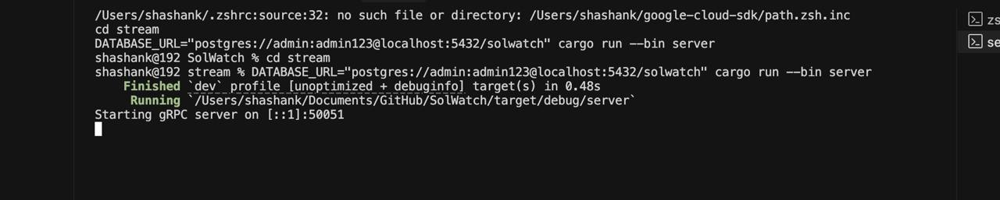
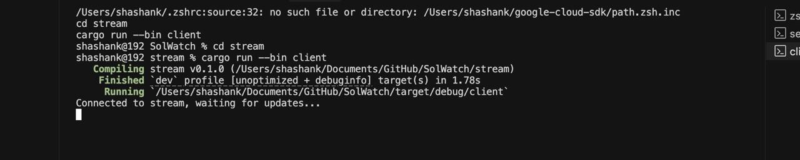

## Solwatch
A fast Solana geyser plugin for real-time account monitoring and data streaming

### Overview
Solana geyser plugin that:
- Stores account data in PostgreSQL for efficient querying
- Streams updates via gRPC for real-time data access
- Tracks both Anchor program accounts and user wallet assets

### Key Features
- **Fast Queries**: PostgreSQL queries are ~10x faster than getProgramAccounts (gPA)
- **Advanced Filtering**: Leverage SQL for complex data filtering
- **Real-time Updates**: gRPC streaming for immediate data access
- **Asset Tracking**: 
  - Monitor user SOL balances
  - Track token holdings
  - Track NFT holdings
- **Anchor Program Support**: Store and stream program account data

### Performance
- SQL queries are approximately 10x faster than RPC getProgramAccounts
- gRPC streaming provides immediate updates compared to polling
- Efficient storage and indexing of on-chain data

### How to Run

Here are screenshots of running the server and client:

